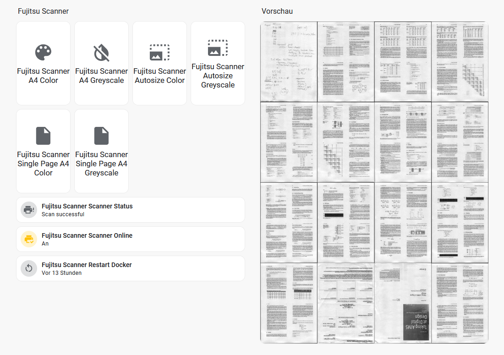

# Homeassistant Scanner Integration + Hardware Button Quick Scan

With this script you can:
- Trigger scans with different presets from Homeassistant
- Trigger scans with your physical scanner button
- Convert, deskew, compress, and pack into a PDF
- Send to your Paperless instance via consume folder
- Get a status of the scan process
- Get a preview of all scanned pages in Homeassistant as images

The script will auto-register a device to the Homeassistant MQTT integration.

There is also an automated backup solution to backup your Paperless instance.

> [!WARNING]
> I was not able to get the system to communicate with the scanner as a non-root user, so I set the Docker container to use the root user. If you know how to properly set the permissions, consider supporting!

> [!NOTE]
> When the scanner is plugged in while the container is running, the Python script will exit, forcing a restart of the Docker container. This is needed to reconnect the container to the scanner as I could not figure out how to auto-connect to a running container.

## Setup

1. Create a `config.py` using `config_example.py` as a template
2. Create a `.env` using the `.env_example` as a template
3. Edit `docker-compose.yml`
4. Run `docker compose up -d`

## Preview

